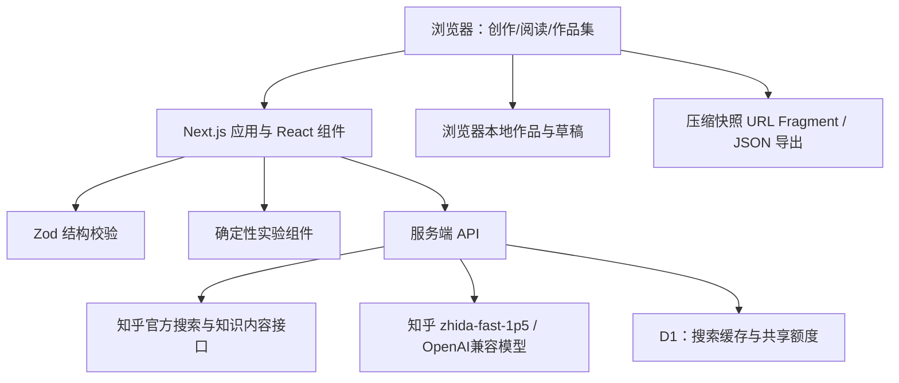

# 玩乎 · 可交互知识工坊

> 知乎黑客松「学习工具与知识生产」赛道｜产品说明计划书｜2026 年 9 月
>
> 项目地址：[wanhu.asia](https://wanhu.asia)　|　最新验证：[发布验证记录](../docs/release-validation.md)

## 一、项目摘要

玩乎是一款面向知乎知识创作者与学习者的可交互知识工坊。它从一个具体疑问和一段可追溯的知乎材料出发，借助 AI 组织教学结构，再由经过验证的互动组件承载实验、预测、反馈和挑战，最终生成可以独立阅读、操作和分享的知识作品。

产品要解决的不是“再生成一段解释”，而是把知乎社区中高质量、但常常停留在阅读层面的知识，转化为一次可参与的理解过程：读者先做判断，再改变参数或做选择，观察结果，理解机制，最后回到原始知乎内容继续阅读。首版以两个边界清晰的案例验证这条链路：梯度下降 `f(x)=x²` 与标准三门问题。

玩乎当前已部署到 [wanhu.asia](https://wanhu.asia)，支持首页、创作、作品集、互动阅读和分享快照；服务端接入知乎官方搜索、知识内容与模型能力，线上构建和真实域名验收记录见 [docs/release-validation.md](../docs/release-validation.md)。

## 二、为什么适合知乎社区

### 2.1 知乎的内容优势与理解断点

知乎擅长沉淀问题、回答、专栏和知识目录。用户可以找到解释，却不一定能判断自己是否真正理解：看过“学习率过大会发散”，未必能预测下一步；看过“三门问题换门胜率是三分之二”，仍可能觉得剩下两扇门是五五开。创作者若想补上这一段体验，通常需要同时具备内容组织、交互设计、数学建模和前端开发能力。

玩乎把这个断点变成产品机会：知乎负责提供问题语境和可追溯材料，玩乎负责把材料组织为可操作的学习作品。它不替代原文，也不把摘要冒充全文，而是在原文与读者之间增加一个“先动手验证，再回到来源”的层次。

### 2.2 三个适配知乎的社区场景

| 场景 | 用户原来的动作 | 玩乎增加的能力 | 对社区的价值 |
| --- | --- | --- | --- |
| 回答者/专栏作者 | 写完解释后等待读者阅读 | 从问题和材料生成可编辑的互动草稿 | 降低知识交互作品的创作门槛 |
| 学习者/读者 | 收藏、阅读、凭感觉判断是否懂了 | 预测、操作、挑战、保存学习副本 | 将被动阅读变成可检验的理解 |
| 教师/社群组织者 | 分享链接或讲义 | 用一个作品承载讲解、实验和来源 | 方便课堂、社群和小规模讨论复用 |

### 2.3 社区关系原则

玩乎尊重知乎内容的来源和作者关系：选定的来源、作者、链接和正文片段随作品保存；读者可以返回知乎继续阅读；引用链接不代表原作者参与、授权或认可玩乎作品。产品不抓取不可见内容，不自动发布、不代替用户操作知乎账号，也不把玩乎生成物伪装成知乎原生内容。

## 三、项目创作思路

### 3.1 从“解释”转向“可验证的理解”

每个作品围绕一个可回答的问题组织，而不是围绕一篇文章堆叠摘要。创作流程固定为：

作者始终拥有最终编辑权。AI负责提炼目标、预测提示、观察问题、机制解释和实验推荐；规则、参数范围、计算和挑战判分由确定性组件负责。

### 3.2 先做窄而可信的实验协议

首版没有承诺“任意文章一键变互动网页”，而是先建立可复用的实验协议：每个主题必须有参数结构、执行规则、边界说明、可解释结果和可测试挑战。这样既能让作品体验稳定，也为后续增加贝叶斯更新、傅里叶分解等主题留下明确接口。

### 3.3 让作者和读者都能看见过程

作者能看到来源、生成草稿、编辑历史和预览；读者能看到自己的初次判断、操作过程、结果和回到原文的入口。作品快照保存当时的内容，后续改稿不会悄悄改变已经分享的版本，便于知乎回答、社群讨论和评审复现。

## 四、用户流程与产品功能

*图 1：线上首页与产品入口（2026-09-13 截图）。*

### 4.1 创作者流程

1. 选择“我想讲清楚”或“我想弄明白”，输入一个核心问题。
2. 粘贴知乎链接、搜索官方知识目录，或补充有权使用的原文段落。
3. 从最多三个来源中选择材料，确认标题、作者和引用范围。
4. 生成结构化教学草稿，核对标题、目标、预测、观察提示、解释和引用。
5. 进入读者视角，验证操作路径，再保存为作品或生成分享链接。
6. 在“我的作品”中继续编辑、复制、搜索、备份或导出 JSON/Markdown。

### 4.2 读者流程

读者打开作品后先留下预测，再进行实验或情境选择，随后查看结果、机制解释和挑战反馈。作品可以保存为自己的学习副本；分享快照不要求读者注册账号，适合在知乎回答、评论区、群聊或课堂中传播。

### 4.3 当前核心组件

**梯度下降**固定函数 `f(x)=x²`，支持初始位置、学习率、单步/连续运行、四种学习率情景和同步轨迹对比。读者可以直接看到收敛、一步到谷底、等幅震荡与发散的差异。

**标准三门问题**记录读者的初选与换门决策，使用同一批初选和奖品位置对照坚持与换门策略，并提供主持人规则说明和模拟频率。组件明确区分理论概率、有限次模拟和不同主持规则，避免把一个结论推广到不适用的情景。

*图 2：线上互动实验页（2026-09-13 截图）。*

*图 3：线上作品集页（2026-09-13 截图）。*

## 五、技术方案

### 5.1 系统架构

### 5.2 技术选型与职责

- **Next.js、React、TypeScript**：复用创作器、阅读器和作品协议，支持本地开发与线上 Node/Caddy 部署。
- **Zod**：校验模型返回的教学结构、来源标识和实验参数；格式不符合协议时最多修复一次。
- **SVG 与纯函数组件**：绘制轨迹、概率和状态变化，计算逻辑独立于模型，便于单元测试和审阅。
- **浏览器本地存储**：保存作品、草稿、撤销/重做和恢复槽，不上传个人探索记录。
- **D1 缓存与限流**：缓存搜索结果、合并相同并发请求并控制服务端额度；不保存输入材料或个人学习记录。
- **Caddy + Node 服务**：线上域名使用 HTTPS，应用监听本机端口，反向代理负责证书与入口。

### 5.3 数据流与边界

选定的知乎摘要或用户补充材料进入服务端生成请求；生成结果只允许引用用户已提供的来源。服务端恢复来源元数据并校验短引句，前端再进入作者编辑器。分享快照只包含互动卡片、短引句和来源，不包含素材库全文或密钥。知乎搜索摘要可能缺少公式和条件，因此界面持续提示作者核对原文。

### 5.4 AI 的职责边界

AI适合组织语言和教学顺序，不适合决定数学事实。模型可以推荐当前支持的实验，不能生成任意 HTML、可执行实验代码或凭空新增来源；不适合的主题应明确返回“不支持”。最终内容必须经过作者核对，产品将“结构通过校验”与“事实已经正确”分开表达。

## 六、可信、隐私与风险控制

- 密钥只存在服务端环境，不进入浏览器、分享链接或日志。
- 不读取知乎账号 Cookie，不绕过不可见内容限制，不自动发布。
- 原始材料和个人探索记录留在用户浏览器；线上数据库只承担缓存和共享额度控制。
- 分享链接是“持有链接即可阅读”的快照，不是权限控制；过长时可使用 JSON 文件。
- 模型、知乎接口或存储异常时保留输入并提供重试/备份入口，预置示例保持可体验。
- 当前项目不宣称学习增益、用户规模或商业收入；这些需要后续研究验证。

## 七、差异化与评审可验证性

| 评审维度 | 可验证证据 |
| --- | --- |
| 社区适配 | 真实知乎搜索、知识内容来源、作者与回链；来源边界说明 |
| 创作效率 | 从问题到草稿、编辑、读者预览和分享的完整流程 |
| 技术可信 | 两类实验的确定性计算、参数边界、结构校验和自动化测试 |
| 学习体验 | 先预测后解释、参数操作、挑战反馈、探索记录 |
| 可复现性 | 公开域名、固定示例、快照链接、JSON/Markdown 导出 |
| 内容责任 | 不冒充全文、不自动发布、不虚构引用、作者最终核对 |

当前验证包括：`npm test` 89/89 通过、类型检查通过、Next 生产构建通过、线上 HTTPS 与主要页面返回 200，以及扩展和浏览器回归记录。自动化通过不等于真实用户研究；下一阶段会用 5 名目标用户观察首次创作完成率、耗时、中断位置、分享后的实际操作和新情景迁移表现。

## 八、版本计划

**提交前版本（当前）**：完成知乎材料导入、AI 草稿、作者编辑、两类互动实验、作品集、分享快照、线上部署和基础安全边界。

**第一阶段验证**：邀请回答者、学生和教师各类用户完成一次“选问题—产出作品—分享—他人操作”，记录流程完成率和失败原因；对学习效果只做探索性观察，不做未经对照的结论。

**第二阶段扩展**：根据重复出现的知识场景增加经验证的实验组件，优先支持能用少量参数说明机制的主题；补充更完整的作者模板、课堂内容包和作品协作能力。

**长期方向**：探索知乎内容生态中的互动回答、专题学习路径和创作者工具，但是否进入站内嵌入、自动发布或商业化，取决于用户需求、内容授权和服务成本验证。

## 九、结语

玩乎希望把知乎社区里“已经有人认真解释过”的知识，进一步变成“读者可以亲手验证”的知识作品。它用知乎的真实问题和材料保持内容连接，用 AI 降低创作门槛，用确定性组件守住实验可信度，再把读者送回原文继续学习。首版从两个小而清晰的案例开始，先证明创作链路和社区价值，再用真实使用反馈决定扩展方向。

## 附录：申报材料索引

- [项目 README](../README.md)
- [提交表单文案](submission-copy.md)
- [三分钟演示脚本](demo-script-3min.md)
- [评审问答与 QA](judge-qa.md)
- [发布验证记录](../docs/release-validation.md)
- [用户测试工作表](usability-5users-worksheet.md)

> 文档中的线上截图来自 2026-09-13 的公开域名；功能和接口状态以发布验证记录为准。
