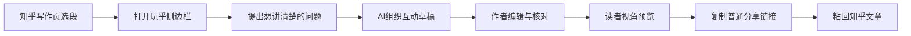
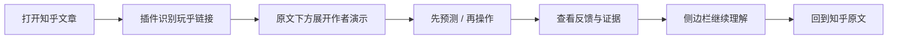
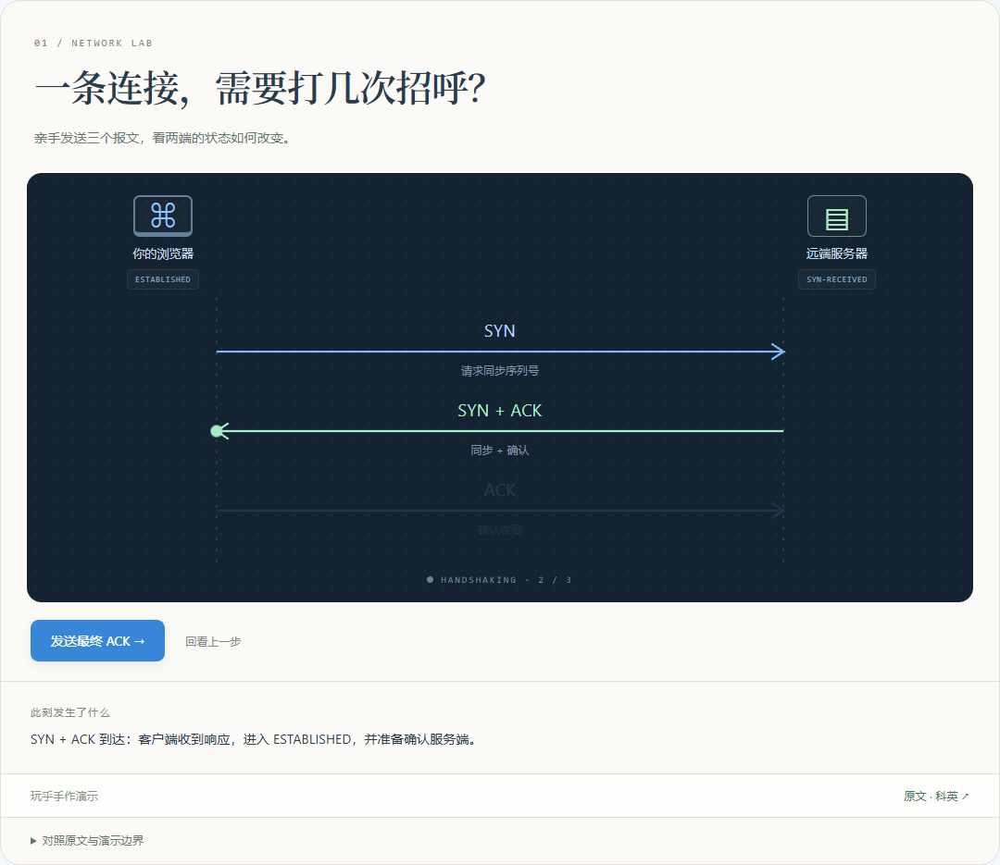
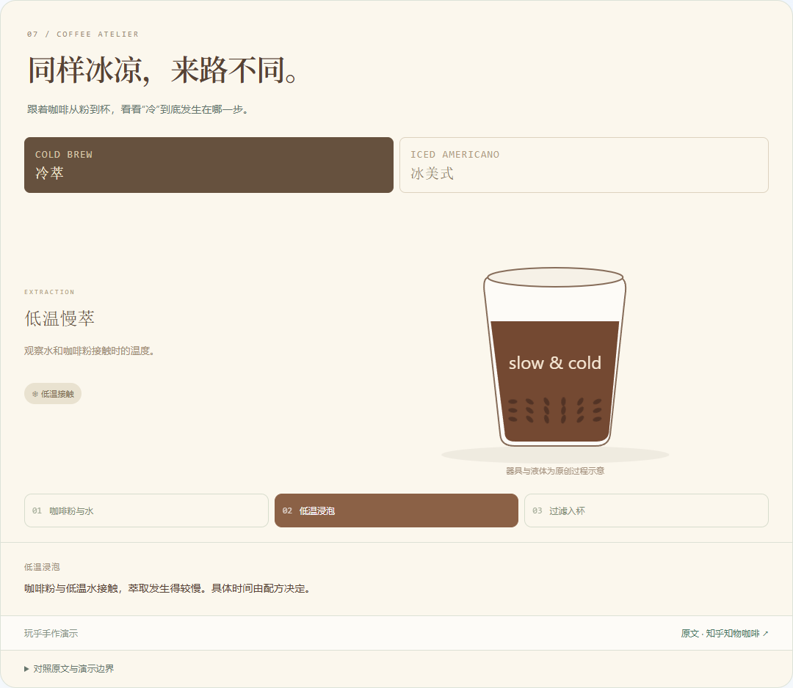
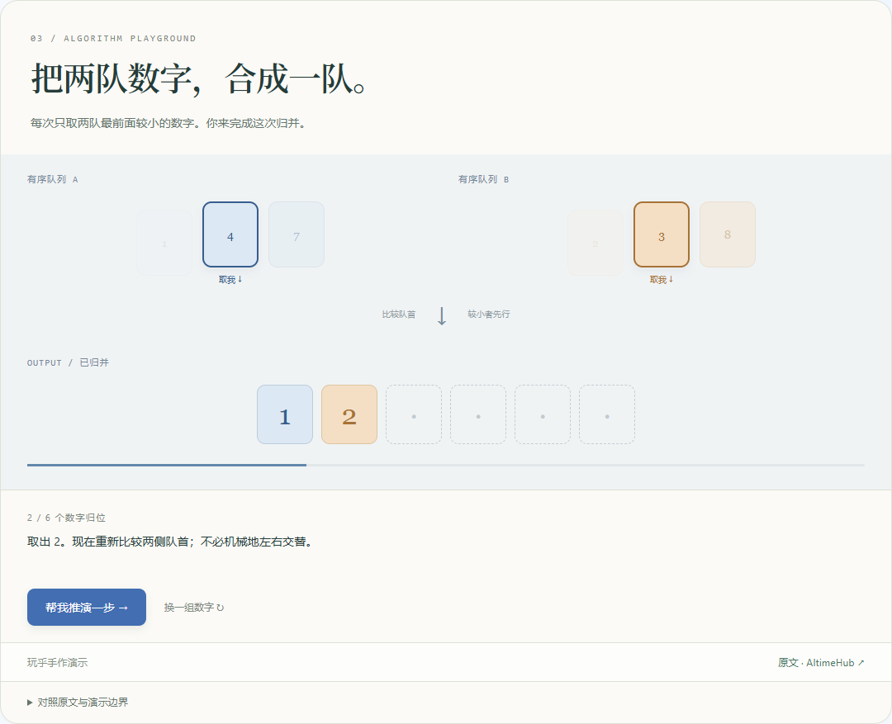
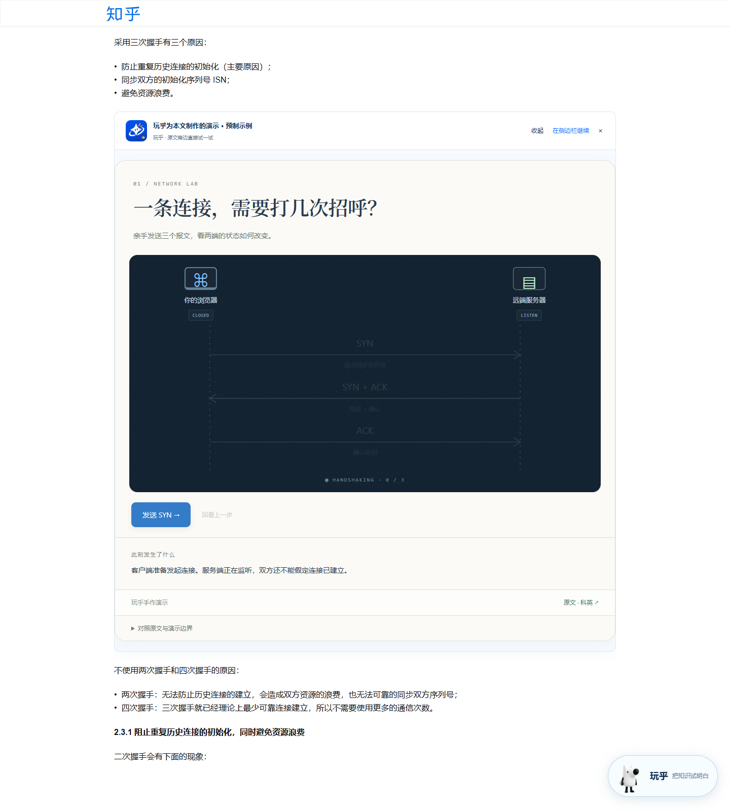
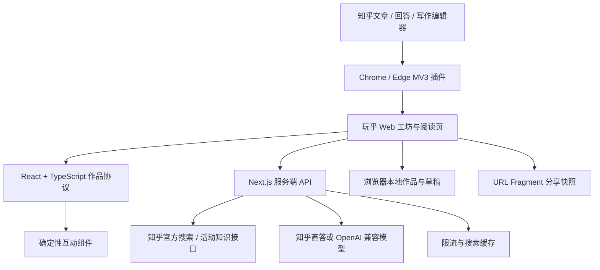

# 玩乎 · 让知乎文章多一个“可以试一试”的入口

> 知乎黑客松「学习工具与知识生产」赛道 · 产品说明计划书
> 项目名称：玩乎（Wanhu）
> 项目地址：[https://wanhu.asia](https://wanhu.asia)
> 插件安装：[https://wanhu.asia/extension](https://wanhu.asia/extension)
> 评审体验：[十篇真实知乎内容与互动演示](https://wanhu.asia/showcase)
> 文档版本：2026 年 9 月 14 日 · 正式上线版（插件 0.4.1）

---

## 一、我们想解决的，不是“没有答案”

知乎社区里有大量认真写过的回答：

- 有人把一个概念讲了几千字；
- 有人把自己的方法拆成了十几个步骤；
- 有人用一篇长文解释一个反直觉结论；
- 有人把多年经验写成了读者可以借鉴的路径。

但读者读完之后，常常只剩下一句模糊的感受：

> “我好像懂了。”

这句话的问题在于，它很难被验证。

读者可能记住了“学习率太大可能发散”，却不知道下一步到底会往哪里走；读者可能背下了“三门问题换门有三分之二胜率”，却仍觉得剩下两扇门应该一人一半；读者也可能看完一篇关于注意力、职业选择或学习方法的文章，却不知道作者的观点在自己的具体情境里是否成立。

创作者也有自己的难题：知乎编辑器很适合写清楚一段话，却不容易把这段话变成一次让读者参与的体验。要做交互，通常还要会设计问题、写前端、做图表、处理状态和验证边界。

**玩乎要补上的，是解释与理解之间那一步。**

它让读者从“看过”走向“做过”，也让作者从“写下来”走向“让读者亲自验证”。

## 二、产品一句话

**玩乎是一款深度融入知乎的可交互知识工具：作者在知乎写作时选中一段文字，生成并编辑互动演示；读者打开文章后，演示会自动出现在原文旁边，边读边试、边试边懂。**

玩乎有两个同级产品形态，其中知乎插件是优先体验入口，网页工坊承接完整编辑与无插件阅读：

### 在知乎使用

Chrome / Edge 浏览器插件直接进入知乎页面：

- 创作者在写作编辑器中选段，生成演示；
- 读者在文章或回答中选段，获得自己的理解；
- 文章里已有玩乎分享链接时，插件自动识别并展开作者附带的互动卡片；
- 正文卡片可以把同一份演示带入侧边栏继续理解。

### 在网页使用

网页工坊提供完整创作和阅读能力：

- 导入知乎文章、回答或黑客松官方知识内容；
- 生成、编辑、核对、预览和分享互动作品；
- 读者无需登录即可打开分享快照；
- 没有安装插件的读者，也能通过普通链接进入完整阅读页。

## 三、为什么它适合知乎

### 3.1 知乎已经有“问题”，玩乎补上“验证”

知乎内容天然以问题为起点：

- 为什么学习率不能无限增大？
- 三门问题为什么换门更容易赢？
- 这套学习方法真的适合我吗？
- 作者说的因果关系，在我的情况里成立吗？

玩乎不替换这些问题，而是把问题变成一个可操作的起点：

1. 读者先预测；
2. 读者做选择或改变参数；
3. 读者看到结果；
4. 读者对照原文和证据；
5. 读者回到知乎继续阅读。

知乎负责沉淀问题、回答和经验，玩乎负责让其中一个观点获得互动的形状。

### 3.2 它尊重知乎原有的内容关系

玩乎不把知乎文章搬走，不把 AI 生成物伪装成原作者内容，也不替用户自动发布。

每个作品都保留：

- 知乎文章或回答链接；
- 作者名和标题；
- 被选取的材料范围；
- 互动题目对应的原句；
- “AI 辅助创作，请核对原文”的提示。

作者发布的是一个普通玩乎链接。安装玩乎的读者看到的是文章旁边的互动批注；其他读者仍然可以正常点击链接阅读。

### 3.3 它给创作者一个新的表达层

知乎创作者擅长讲清楚，但不一定需要自己从零实现交互。

玩乎把创作过程拆成几个低门槛动作：

- 选一段真正关键的文字；
- 写下想让读者弄懂的问题；
- 让 AI 先组织教学草稿；
- 由作者修改标题、解释、反馈和引用；
- 选择合适的互动组件；
- 用读者视角检查后发布链接。

作者仍然掌握最终表达权。AI 是助手，不是署名者。

## 四、典型使用场景

### 场景 A：先帮作者想清楚，再让读者亲手试

作者正在写一段关于 TCP 三次握手的解释，担心读者只记住了 SYN、ACK，却没有理解双方分别确认了什么。作者在知乎编辑器中打开玩乎，页面先识别为创作者场景；选段后，可以先问一句：“这段有没有跳过读者需要知道的前提？”

轻量辅助直接给出解释、类比或论证检查，不必为一个小问题生成整份作品。作者把问题收敛为“让读者看到每个报文抵达后，两端状态怎样变化”，再进入互动生成与核对。一般生成可以采用 SVG 分镜组织报文移动；本次评审另有开发者直接编写的 TCP 专用示例，展示更完整的手动发送与状态变化。

生成完成后，插件自动展示本页正文预览，作者仍需自己核对内容并把普通分享链接粘回知乎。预览不会自动改写或发布编辑器里的文章。

### 场景 B：读者读到反直觉结论，立即动手验证

读者在知乎回答里看到“三门问题换门胜率是三分之二”。他不需要离开页面搜索另一个解释，只要选中这段话，打开玩乎：

- 先选一扇门；
- 让主持人按标准规则打开空门；
- 决定是否换门；
- 运行 100 次或 1000 次模拟；
- 回看初选、奖品位置和规则说明。

读者最后拿到的不是一句“答案是 2/3”，而是一条自己的操作记录和可以回到知乎核对的解释。

### 场景 C：作者把抽象概念变成可观察的变化

作者讲梯度下降时，读者通常只能看到公式和一张静态图。玩乎把它变成一个小实验：

- 初始位置固定在曲线上；
- 学习率可以拖动；
- 小球沿着梯度更新；
- 读者可以看到收敛、震荡、一步到谷底和发散；
- 旁边保留函数、参数和模型边界。

抽象概念仍然来自原文，互动只是帮助读者把“变化”看见。

### 场景 D：教师或社群组织者把一篇回答变成一次讨论

教师可以把一篇讲相关与因果的知乎回答作为课前材料，让学生先观察共同原因如何同时改变两个量，再试着只干预其中一个量。学生对照原文说明“哪些变化一起发生，哪些变化可以由干预导致”。课后可以分享作品链接继续讨论。评审预制的因果沙盘采用明确标注的教学模型，不把示意数值当成真实统计证据。

## 五、用户流程

### 5.1 创作者流程



发布后的文章仍然由知乎承载。玩乎链接是文章中的一个普通链接；安装插件的读者会在链接附近自动看到互动卡片。

### 5.2 读者流程



如果文章没有玩乎链接，读者仍可以选中任意可见段落，自己生成一份理解。读者自己的作品保存在当前浏览器，不会冒充作者附带内容。

### 5.3 网页工坊流程

网页工坊是完整的独立入口：

1. 选择“我想讲清楚”或“我想弄明白”；
2. 粘贴知乎文章 / 回答链接，或导入官方知识内容；
3. 预览材料、作者和来源范围；
4. 选择问题并生成草稿；
5. 核对并编辑解释、证据、分镜、分支或模型参数；
6. 打开读者视角；
7. 生成 `https://wanhu.asia/view#v1...` 分享快照；
8. 复制链接到知乎文章、评论区、群聊或课堂。

## 六、核心功能与作品形式

### 6.1 内容先行，不再默认把文章改成考题

一段解释 TCP 的文字，真正需要的是看报文往哪里走；一段讲咖啡的文字，需要比较低温发生在哪个环节；一个机会成本概念，需要看选择一件事时到底放弃了什么。它们不该被统一装进“三个选项、选一个答案”。

模型按材料选择形式：SVG 分镜呈现对象移动和步骤演化；分支流程把条件变成可比较的路径；有数量关系时才使用参数模型。情境测验继续兼容，但只在用户要求练习题时选用。

SVG 分镜支持播放、暂停、速度选择、拖动时间线、单步以及点击对象。分支可以回退与重走，不用正确率给个人选择打分。数值模型支持固定条件作对照，避免拖过滑杆后忘记之前的结果。

### 6.1.1 十篇真实内容，十份直接编写的演示

评审可直接打开 [已上线的集中体验页](https://wanhu.asia/showcase)，或安装插件后访问下表原文。完整清单也直接收录在本说明书，逐篇引用、作者及简化边界见 [详细体验指南](real-article-demos.md)。十篇各有直接编写的专用组件：亲手发送报文、操作归并队列、比较咖啡制备、调整主观偏好计算机会成本、检索笔记桌、合上材料转述、干预因果沙盘，以及两篇生物过程图和热榜衰减曲线。

这十份作品由玩乎开发者直接编写和检查，不调用产品内置模型生成，也不作为现场 AI 生成成绩。每份只引用原文的短句，保留出处，注明示意与事实的边界。原文存在不准确措辞时不照搬，例如热榜示例明确区分“指数衰减”和“与时间成反比”。

安装新版插件，打开指定文章或回答，演示会自动出现在正文旁，并标明“玩乎为本文制作的演示 · 预制示例”。作者的头像、昵称与原文保持原样。真实移动阅读页面的本机验收结果为 10/10 自动嵌入；无法访问知乎时仍可打开同一份网页演示。

| # | 知乎原文 | 互动形式 | 网页入口 |
|---|---|---|---|
| 01 | [十年码农内功：TCP篇](https://www.zhihu.com/tardis/bd/art/612982114) | 专用 SVG 场景 | [直接体验](https://wanhu.asia/view?example=showcase-tcp-handshake) |
| 02 | [牛顿冷却定律在热度排行榜中的实践：保持内容新鲜的科学方法](https://www.zhihu.com/tardis/zm/art/656807488) | 热度曲线对照 | [直接体验](https://wanhu.asia/view?example=showcase-heat-decay) |
| 03 | [经典排序算法汇总](https://www.zhihu.com/tardis/bd/art/430367415) | 可操作归并 | [直接体验](https://wanhu.asia/view?example=showcase-merge-sort) |
| 04 | [如何构建个人资料库与个人知识库？](https://www.zhihu.com/tardis/bd/ans/1310435050) | 可检索笔记桌 | [直接体验](https://wanhu.asia/view?example=showcase-notes-workflow) |
| 05 | [告别无效努力：这八本书将彻底颠覆你的阅读与学习方式](https://www.zhihu.com/tardis/bd/art/1961531467042633609) | 翻页转述练习 | [直接体验](https://wanhu.asia/view?example=showcase-active-reading) |
| 06 | [机会成本](https://www.zhihu.com/tardis/bd/art/4416452409) | 取舍计算桌 | [直接体验](https://wanhu.asia/view?example=showcase-opportunity-cost) |
| 07 | [冷萃咖啡和冰美式比有什么区别？](https://www.zhihu.com/tardis/bd/art/632439891) | 咖啡制备场景 | [直接体验](https://wanhu.asia/view?example=showcase-coffee-process) |
| 08 | [相关性与因果有什么联系与区别？](https://www.zhihu.com/tardis/bd/ans/2319205611) | 因果干预沙盘 | [直接体验](https://wanhu.asia/view?example=showcase-causal-evidence) |
| 09 | [高等植物和藻类的能量转换器：叶绿体](https://www.zhihu.com/tardis/bd/art/597424073) | 专用 SVG 场景 | [直接体验](https://wanhu.asia/view?example=showcase-chloroplast) |
| 10 | [C4植物的C4途径](https://www.zhihu.com/tardis/zm/art/682891737) | 专用 SVG 场景 | [直接体验](https://wanhu.asia/view?example=showcase-c4-transfer) |

这十篇包含八篇文章与两篇回答，覆盖技术、学习方法、日常生活、经济概念和生物知识。形式选择围绕读者要做的动作：归并排序要求亲手合并队列，主动阅读要求合上材料复述，咖啡对比要求观察制备环节，C4 要求跟随碳在细胞间转移。它们展示的是不同知识怎样值得被“玩”一次。



*亲手发送报文，观察浏览器和服务器状态变化。截图取自本地实际运行的本轮版本，同版代码已上线。*



*切换冷萃与冰美式，逐步看低温浸泡、热水萃取和加入冰水分别发生在哪一步。*



*读者取出两个有序队列的队首，逐个形成结果；选到较大的数时，界面解释为什么此刻应先取另一边。*



*真实知乎原文与本地新版插件的自动嵌入实拍。保留原作者信息，单独标明玩乎预制身份；没有把测试文章或生成图片当成真实页面截图。*

### 6.1.2 自动嵌入，让三种内容归属清楚可辨

| 情形 | 如何出现 | 内容归属与发布边界 |
|---|---|---|
| 作者在文章中附带玩乎分享链接 | 插件识别普通链接并提供正文互动卡片 | 作者主动分享的作品；插件不代作者发布文章 |
| 本次十篇评审示例 | 插件匹配明确的文章或回答 ID，正文加载后自动嵌入 | 标注“玩乎为本文制作的演示 · 预制示例”，不声称原作者参与 |
| 读者自己选段生成 | 生成后自动在本页预览，也可在侧边栏继续 | 读者自己的解释，不会变成其他读者可见的知乎正文 |

安装 0.4.1 插件后，打开十篇指定原文即可体验预制作品，不需要选段、等待模型或手动插入。没有插件时，点击本节网页入口同样可以操作。自动嵌入只在本机浏览器增加一层展示，不改变知乎保存的原文。

### 6.1.3 辅助构思保持轻量，互动演示保持主角

作者可能先需要“这段还缺什么前提”，读者可能只想问“换个例子解释一下”。侧边栏与网页支持独立的选段辅助及连续追问：作者侧检查前置知识、论证跳步、简短提纲和类比；读者侧解释选段、补概念、换例子。回答直接呈现，不强制生成作品。只有问题值得通过操作理解时，再进入互动生成。它辅助当前这段材料，不扩展成整篇代写工具。

### 6.2 梯度下降实验

固定模型为 `f(x)=x²`，让读者观察参数怎样改变过程：

- 初始位置；
- 学习率；
- 当前步数；
- 当前损失；
- 收敛、震荡、一步到谷底和发散状态；
- 多个学习率的轨迹对比。

组件计算由程序完成，AI 不会临时生成一段可执行代码来决定结果。

### 6.3 标准三门问题实验

组件把容易混淆的规则写在台面上：

- 奖品只在三扇门中的一扇；
- 主持人知道奖品位置；
- 主持人始终打开一扇未选中的空门；
- 主持人始终提供换门机会。

读者先做初选，再决定坚持或换门；模拟使用同一批初选和奖品位置进行对照，并把理论概率、有限次模拟和主持规则分开说明。

## 七、技术方案

### 7.1 总体架构



### 7.2 技术选型

- **Next.js 16 + React 19 + TypeScript**：网页工坊、阅读页和服务端路由。
- **Chrome / Edge Manifest V3**：注入知乎页面的正文卡片、侧边栏入口和分享链接识别。
- **Zod**：校验 AI 返回的作品结构、来源 ID、证据引用和实验参数。
- **SVG 与纯函数计算**：绘制曲线、轨迹和概率结果，避免把关键事实交给模型。
- **浏览器本地存储**：保存草稿、作品、撤销 / 重做、恢复记录和读者探索状态。
- **URL Fragment 快照**：把作品压缩后放进 `/view#v1...`，服务端不需要保存每一份作品正文。
- **Caddy + Node.js + systemd**：线上 VPS 的 HTTPS、反向代理和进程管理。
- **Cloudflare**：DNS 代理、HTTP/3 和静态资源边缘传输。

### 7.3 AI 的职责边界

AI 负责：

- 理解用户的问题；
- 组织导入、预测、观察和解释；
- 推荐适合的互动形式；
- 生成可编辑的分镜对象与步骤、条件分支、合法参数模型配置；
- 在独立选段辅助中回答作者和读者的简短追问。

AI 不负责：

- 自由生成任意 HTML 或可执行脚本；
- 创造不存在的来源；
- 把搜索摘要说成全文；
- 决定梯度下降和三门问题的计算结果；
- 代替作者确认事实；
- 自动操作或发布知乎账号内容。

生成结果通过结构校验和来源证据校验后才会进入编辑器。SVG 分镜与分支采用受约束的数据协议，由本地 React/SVG 组件渲染；参数公式在受限计算器中执行。结构合法不等于解释科学，作品页仍提醒作者核对模型假设和原文关系。

十篇手作组件走明确的预制识别路径，打开时不调用生成接口；未改动作品通过分享快照还原后仍可展示专用界面。用户修改底层作品后，转入通用可编辑渲染，避免专用程序忽略修改。普通实时生成可选择已支持的通用形式，不能据此宣称模型会从零写出这十个专用应用。

## 八、知乎接口与社区融合

当前项目已经接入或预留以下能力：

- 知乎官方搜索：通过知乎内容链接或关键词获取社区材料摘要；
- 黑客松官方知识内容：读取活动提供的知识目录和 `/story/{work_id}` 详情；
- 知乎生成适配器：在服务端配置 Access Secret 后调用官方生成能力；
- 知乎 OAuth：代码已具备授权跳转、`state` 防重放、`/user` 基础资料读取、退出登录和授权用户数据入口，正式 App ID / App Key 由赛事后台发放后进行真实联调；
- Chrome / Edge 插件：作为知乎页面中的阅读和创作入口。

Access Secret、OAuth App Key、模型 API Key 和 OAuth Token 只放服务端环境，不进入浏览器、分享链接、仓库或日志。

## 九、可信边界、隐私和风险控制

1. 普通知乎文章或回答目前通过官方搜索匹配摘要，不能承诺获得任意文章全文。
2. 对不可见、折叠、登录后才可见的内容，插件不会绕过限制抓取。
3. 分享链接是“持有链接即可阅读”的内容快照，不是权限控制。
4. 读者自己的作品和探索记录只保存在当前浏览器。
5. 线上数据库只承担搜索缓存、限流和共享额度保护，不保存个人原始材料。
6. 作品中的引用链接不代表知乎或原作者参与、授权或认可。
7. 插件不读取知乎 Cookie，不自动发布，不改写知乎编辑器正文。
8. 线上服务依赖模型和知乎接口，异常时保留输入并允许重试、备份或使用预置示例。

## 十、黑客松版本与后续计划

### 当前可提交版本

- 知乎插件与网页工坊双入口；
- 作者选段生成、编辑、读者预览和分享；
- 读者正文自动识别和互动卡片；
- 十篇真实知乎内容对应的手作专用演示，以及原文自动嵌入；
- SVG 分镜、分支路径、参数模型、梯度下降和标准三门问题；
- 独立的作者构思、读者解释与轻量连续追问；
- 知乎来源、作者信息、逐字证据和回链；
- 本地作品集、备份、撤销 / 重做和 JSON / Markdown 导出；
- 线上 HTTPS、Cloudflare 代理和插件下载安装页；
- 本地 107 项单元测试、47 项网页测试、12 项插件测试通过，类型检查及生产构建通过；
- 2026 年 9 月 14 日已部署至 `https://wanhu.asia`，插件版本 0.4.1；
- 正式域名新增 8 项交互验收全部通过，覆盖十篇页面、390px 宽度、专用交互和分享还原；线上插件包与发布包校验一致；
- 十篇真实知乎移动阅读页面在本机逐一验证，10/10 自动嵌入。该结果与正式域名测试分别记录，不当作所有知乎页面始终可访问的保证。

详细发布证据见 [部署与验收记录](../docs/deployment-2026-09-14.md)。当前 OAuth 尚待赛事应用凭证真实联调；正文、插件与工坊通过作品快照接续，尚不是云端共享版本服务。手作演示的视觉完成度与实时 AI 输出质量分别展示，不合并宣传。

### 第一阶段：真实用户验证

邀请回答者、学生和教师完成一次完整流程：

```
选问题 → 生成作品 → 作者核对 → 分享 → 读者操作 → 回到原文
```

记录：

- 首次进入后是否知道从哪里开始；
- 从选段到生成作品需要多久；
- 哪个步骤最容易中断；
- 读者是否真的操作了演示；
- 读者能否说出自己刚才验证了什么；
- 一篇文章中的互动卡片是否打断阅读。

### 第二阶段：扩展经过验证的互动组件

优先增加能被少量参数解释清楚的主题，例如：

- 贝叶斯更新；
- 条件概率；
- 排队与等待；
- 复利和增长；
- 信息检索与排序；
- 方案权衡和条件分支。

每个新增组件都先建立规则、边界、解释和测试，再接入 AI 推荐。

### 长期方向

如果真实用户持续需要，玩乎可以成为知乎内容生态中的一层“互动理解协议”：

- 回答者发布可互动的解释；
- 读者保存自己的理解过程；
- 教师把高质量回答组织成学习路径；
- 社群围绕同一份作品讨论不同选择；
- 知乎内容在保留原文的同时，拥有可复用的互动层。

是否进一步接入知乎站内原生内容形态、自动发布或多人协作，需要基于用户需求、授权边界和服务成本再决定。

## 十一、评审演示建议

建议评审先体验成品，再单独验证实时生成，全程区分两者。

| 时间 | 操作 | 重点看什么 |
|---|---|---|
| 0:00–0:45 | 安装新版插件后打开 TCP 原文，发送三个报文 | 无需点击生成，预制演示自动嵌入；两端状态随操作变化 |
| 0:45–1:20 | 从集中体验页打开咖啡示例，切换冷萃与冰美式 | 生活知识通过器具与过程讲解，不是统一的问答题 |
| 1:20–1:50 | 打开归并排序，亲手合并两条队列 | 读者的动作影响结果，错误操作得到机制解释 |
| 1:50–3:00 | 在另一篇非预制文章选段，先简短追问，再尝试生成 | 观察真实模型选择形式与返回时间，核对来源；这一段不冒充预制作品效果 |

若评审继续体验创作者流程，可在知乎编辑器中先检查选段论证，再生成、核对本页预览，复制分享链接自行粘入文章。发布后安装插件的读者可以识别链接，无插件读者可打开网页。演示现场无需为了证明链路而发布一篇临时文章。

实时生成依赖网络和模型，三分钟只是建议节奏，不承诺固定响应时长。知乎遇到登录或验证时，使用表格中的网页入口继续体验，不把网页演示描述为知乎原文已成功加载。

> 一篇文章讲清楚了什么，读者最好能亲手试出来。玩乎让这一步留在原文旁边。

## 十二、结语

知乎社区最珍贵的东西，是有人愿意认真回答一个问题。

玩乎想做的，是让这些回答在读者手里再多走一步：从一段文字，变成一次判断；从一句结论，变成一次操作；从“我好像懂了”，变成“我亲手试过了”。

作者仍然在知乎写作，读者仍然回到知乎阅读，来源仍然属于原文。玩乎只在中间加了一层轻巧的互动，让知识不止被看见，也能被试出来。


### 提交前的四条真实使用路径验收

本轮按知乎插件与网页、创作者与读者逐条检查，修复了 SVG 首帧播放崩溃、真实知乎链接导入、读者新建角色丢失、知乎包装外链自动识别、正文演示与侧栏列表接续和窄屏遮挡。已有插件需要更新至 0.4.1 并刷新知乎。详细流程、真实测试与能力边界见 [两端两用户验收记录](../docs/journey-audit-2026-09-14.md)。
