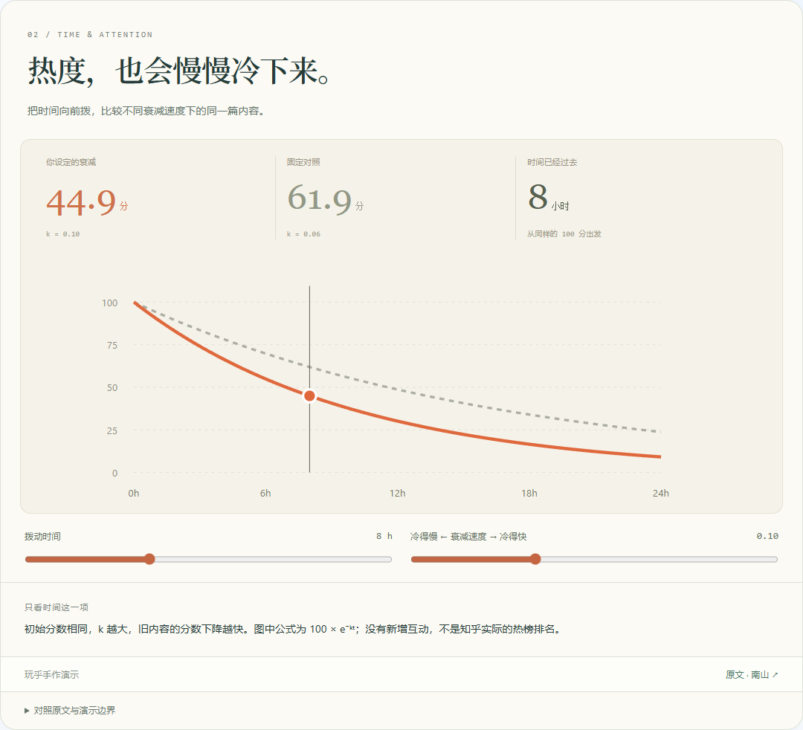
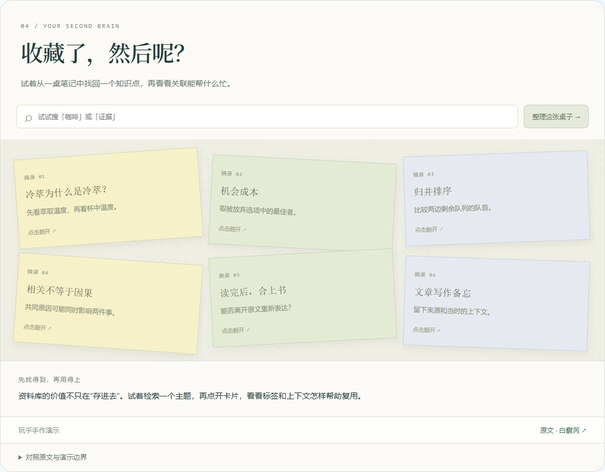
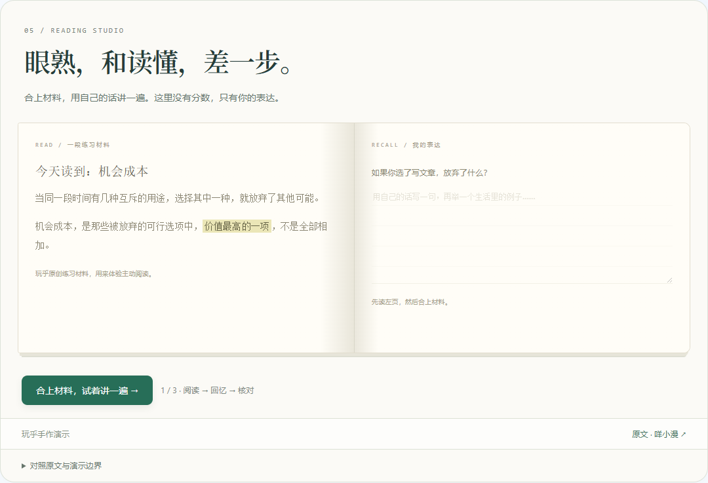
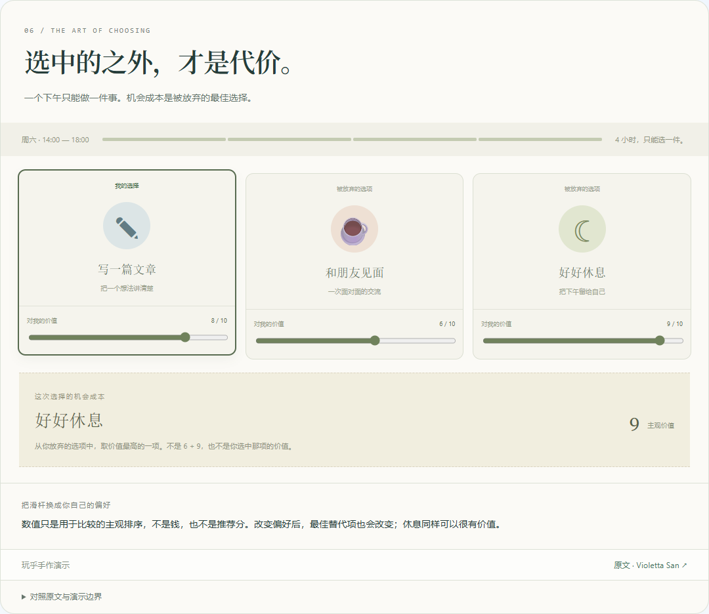
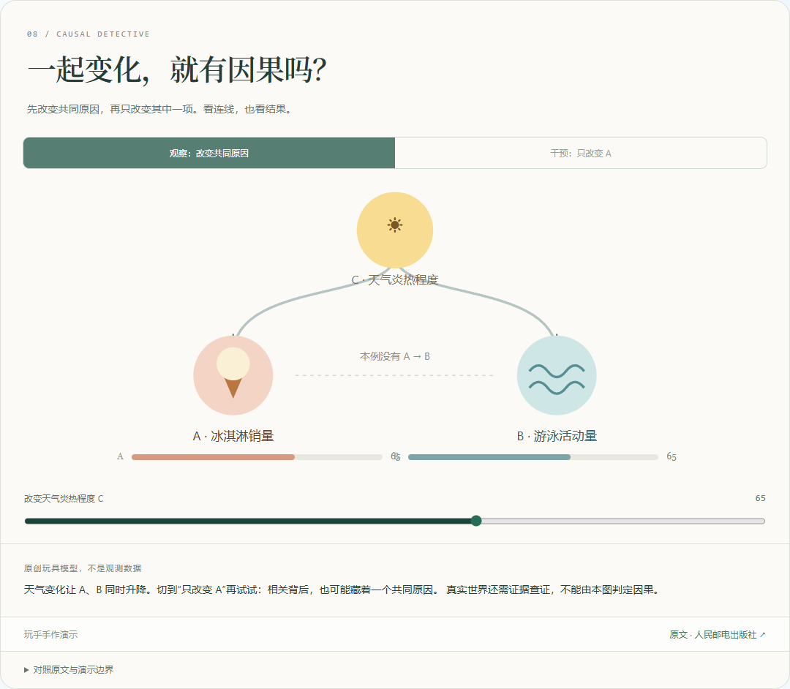
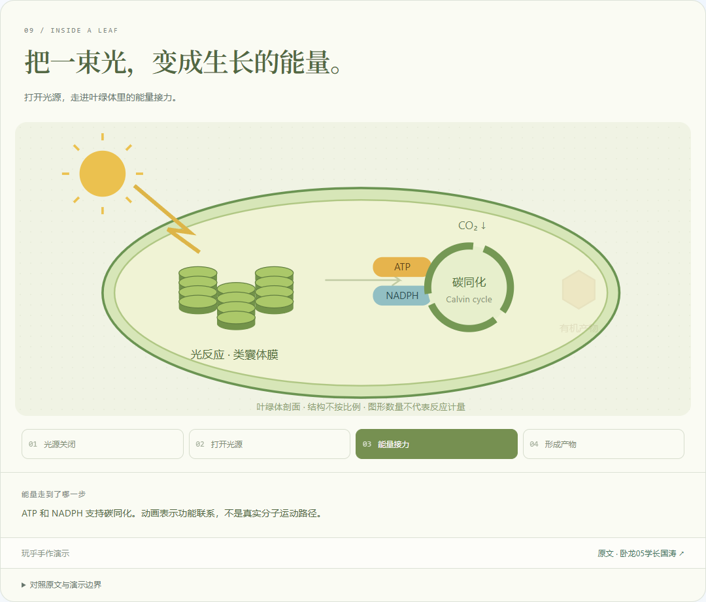
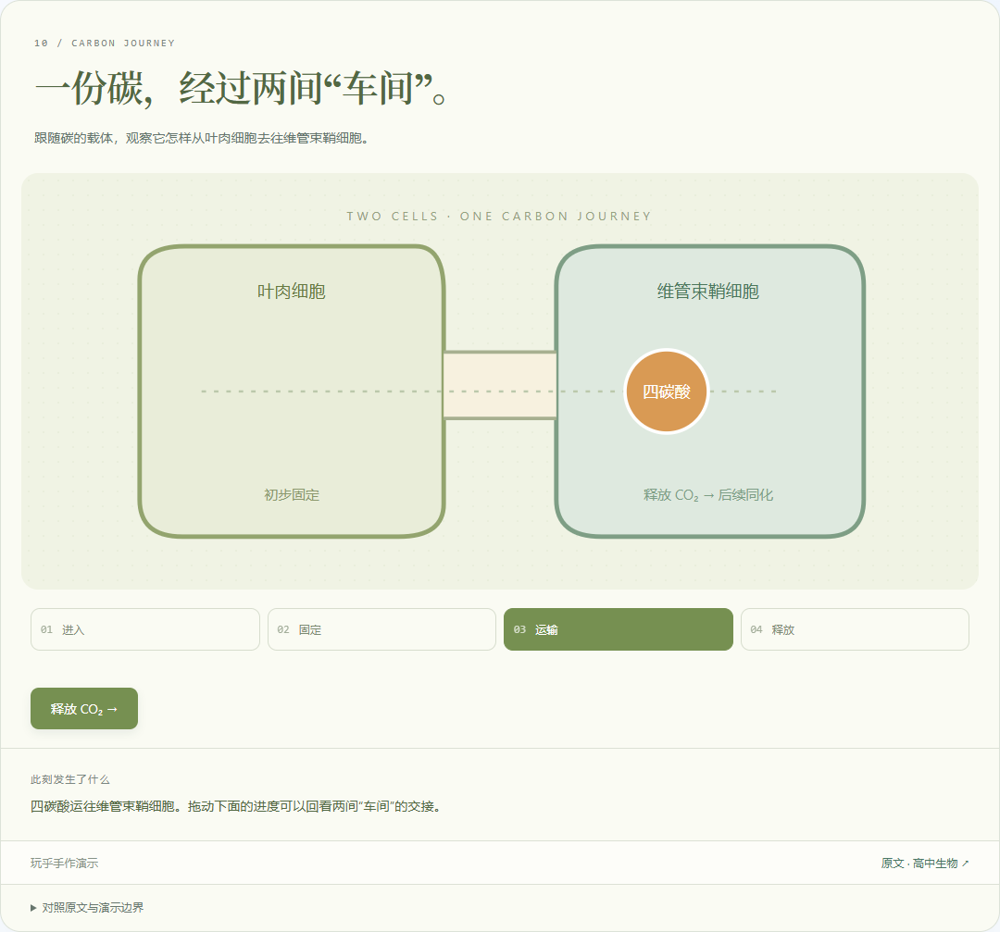

# 玩乎：10 篇真实知乎内容体验指南

这是一组由玩乎直接写代码、逐篇设计画面与交互的演示作品，不调用产品内置生成模型，用来展示知识内容与不同互动形式的适配；不计作现场 AI 生成，也不代表原作者参与或认可。

## 怎么体验

1. 安装玩乎 0.4.0 或更高版本插件，重新加载扩展并刷新知乎页面。
2. 打开下表的知乎原文。正文加载后，插件会自动加入“玩乎为本文制作的演示 · 预制示例”。不必选段或点击生成，不会额外调用模型。
3. 也可以从 [集中体验页](https://wanhu.asia/showcase) 进入。知乎要求登录或安全验证时，先使用网页演示。
4. 要验证实时 AI 能力，请另选非预制文章：选段 → 生成。模型可自行选择 SVG 分镜、分支流程、参数模型、现有专用实验；预制识别与实时生成是两条明确区分的路径。

**版本状态：**本轮包含十篇手作演示与 0.4.0 插件；正式入口：https://wanhu.asia/showcase。实际发布版本及线上验收见 [部署记录](../docs/deployment-2026-09-14.md)。

## 建议体验顺序

先体验 01 三次握手（亲手发报文），再体验 07 咖啡（制备过程），最后体验 02 热榜衰减（数值）。三篇合计约 3 分钟，可看出不同文章如何选择不同表达方式。其余用于扩展评审与自主探索。

## 十篇清单

| # | 知乎原文 | 互动形式 | 网页入口 |
|---|---|---|---|
| 01 | [十年码农内功：TCP篇](https://www.zhihu.com/tardis/bd/art/612982114) | 专用 SVG 场景 | [直接体验](https://wanhu.asia/view?example=showcase-tcp-handshake) |
| 02 | [牛顿冷却定律在热度排行榜中的实践：保持内容新鲜的科学方法](https://www.zhihu.com/tardis/zm/art/656807488) | 热度曲线对照 | [直接体验](https://wanhu.asia/view?example=showcase-heat-decay) |
| 03 | [经典排序算法汇总](https://www.zhihu.com/tardis/bd/art/430367415) | 可操作归并 | [直接体验](https://wanhu.asia/view?example=showcase-merge-sort) |
| 04 | [如何构建个人资料库与个人知识库？](https://www.zhihu.com/tardis/bd/ans/1310435050) | 可检索笔记桌 | [直接体验](https://wanhu.asia/view?example=showcase-notes-workflow) |
| 05 | [告别无效努力：这八本书将彻底颠覆你的阅读与学习方式](https://www.zhihu.com/tardis/bd/art/1961531467042633609) | 翻页转述练习 | [直接体验](https://wanhu.asia/view?example=showcase-active-reading) |
| 06 | [机会成本](https://www.zhihu.com/tardis/bd/art/4416452409) | 取舍计算桌 | [直接体验](https://wanhu.asia/view?example=showcase-opportunity-cost) |
| 07 | [冷萃咖啡和冰美式比有什么区别？](https://www.zhihu.com/tardis/bd/art/632439891) | 咖啡制备场景 | [直接体验](https://wanhu.asia/view?example=showcase-coffee-process) |
| 08 | [相关性与因果有什么联系与区别？](https://www.zhihu.com/tardis/bd/ans/2319205611) | 因果干预沙盘 | [直接体验](https://wanhu.asia/view?example=showcase-causal-evidence) |
| 09 | [高等植物和藻类的能量转换器：叶绿体](https://www.zhihu.com/tardis/bd/art/597424073) | 专用 SVG 场景 | [直接体验](https://wanhu.asia/view?example=showcase-chloroplast) |
| 10 | [C4植物的C4途径](https://www.zhihu.com/tardis/zm/art/682891737) | 专用 SVG 场景 | [直接体验](https://wanhu.asia/view?example=showcase-c4-transfer) |

### 1. 三次握手：三个报文往哪走？

- 原文：[十年码农内功：TCP篇](https://www.zhihu.com/tardis/bd/art/612982114)
- 作者：科英
- 操作：依次点击发送 SYN、返回 SYN + ACK、发送最终 ACK，观察浏览器与服务器的状态；可回看上一步。
- 与原文的连接：围绕“同步双方的初始化序列号”这个短句所描述的机制展开。
- 简化边界：玩乎原创示意图，形状、距离、速度不按真实比例，仅展示原文中选定的机制，不复刻原文图片。
- 专用演示截图：

- 可下载作品：[tcp-handshake.json](../public/showcase/tcp-handshake.json)（新版应用可识别并展示手作界面；编辑底层内容后转为通用结构渲染）

### 2. 热榜上的旧内容，怎样逐渐降温？

- 原文：[牛顿冷却定律在热度排行榜中的实践：保持内容新鲜的科学方法](https://www.zhihu.com/tardis/zm/art/656807488)
- 作者：南山
- 操作：拖动时间与衰减速度，比较当前内容与固定 k=0.06 对照；数值为教学设定。
- 与原文的连接：围绕“较小的k值导致热度冷却得较慢”这个短句所描述的机制展开。
- 简化边界：仅采用原文的指数衰减公式，不沿用其中“与时间成反比”的不准确说法。初始100分、k=0.1均为教学设定；忽略新增点赞与其他权重，不代表知乎真实热榜算法或实际热度。
- 专用演示截图：

- 可下载作品：[heat-decay.json](../public/showcase/heat-decay.json)（新版应用可识别并展示手作界面；编辑底层内容后转为通用结构渲染）

### 3. 归并的一步：两排数字怎样合成一排？

- 原文：[经典排序算法汇总](https://www.zhihu.com/tardis/bd/art/430367415)
- 作者：AItimeHub
- 操作：点击 A、B 两队的首个数字，完成六个数字的归并。试着先取较大的数字，再观察连续取同一侧的情况。
- 与原文的连接：围绕“将已有序的子序列合并”这个短句所描述的机制展开。
- 简化边界：玩乎原创示意图，形状、距离、速度不按真实比例，仅展示原文中选定的机制，不复刻原文图片。
- 专用演示截图：

- 可下载作品：[merge-sort.json](../public/showcase/merge-sort.json)（新版应用可识别并展示手作界面；编辑底层内容后转为通用结构渲染）

### 4. 笔记该记什么，才能再次用起来？

- 原文：[如何构建个人资料库与个人知识库？](https://www.zhihu.com/tardis/bd/ans/1310435050)
- 作者：白馥芮
- 操作：整理笔记桌面，搜索“咖啡”或“证据”，打开卡片找回主题、关联与上下文。六张笔记是原创操作样本。
- 与原文的连接：围绕“能迅速查找到所需内容”这个短句所描述的机制展开。
- 简化边界：玩乎编写的教学情境，聚焦原文一个要点；路径不是原作者提供的判断工具，也不代表适用于所有人。
- 专用演示截图：

- 可下载作品：[notes-workflow.json](../public/showcase/notes-workflow.json)（新版应用可识别并展示手作界面；编辑底层内容后转为通用结构渲染）

### 5. 从“读过了”走到“能说清楚”

- 原文：[告别无效努力：这八本书将彻底颠覆你的阅读与学习方式](https://www.zhihu.com/tardis/bd/art/1961531467042633609)
- 作者：咩小漫
- 操作：阅读左页，合上材料，用自己的话转述，然后重新打开自行核对。文字不发送模型，不自动判分。
- 与原文的连接：围绕“带着问题阅读”这个短句所描述的机制展开。
- 简化边界：玩乎编写的教学情境，聚焦原文一个要点；路径不是原作者提供的判断工具，也不代表适用于所有人。
- 专用演示截图：

- 可下载作品：[active-reading.json](../public/showcase/active-reading.json)（新版应用可识别并展示手作界面；编辑底层内容后转为通用结构渲染）

### 6. 选了一件事，究竟放弃了什么？

- 原文：[机会成本](https://www.zhihu.com/tardis/bd/art/4416452409)
- 作者：Violetta San
- 操作：选择一个下午的安排，再调节三个选项的主观价值；观察最高价值的被放弃项如何改变。
- 与原文的连接：围绕“放弃的其他用途中所能得到的最高收益”这个短句所描述的机制展开。
- 简化边界：玩乎编写的教学情境，聚焦原文一个要点；路径不是原作者提供的判断工具，也不代表适用于所有人。
- 专用演示截图：

- 可下载作品：[opportunity-cost.json](../public/showcase/opportunity-cost.json)（新版应用可识别并展示手作界面；编辑底层内容后转为通用结构渲染）

### 7. 冷萃与冰美式，差别发生在哪一步？

- 原文：[冷萃咖啡和冰美式比有什么区别？](https://www.zhihu.com/tardis/bd/art/632439891)
- 作者：知乎知物咖啡
- 操作：切换冷萃与冰美式，点击备料、萃取和成品步骤，比较低温发生在萃取还是饮用阶段。
- 与原文的连接：围绕“冷萃则是冷水萃取咖啡”这个短句所描述的机制展开。
- 简化边界：玩乎编写的教学情境，聚焦原文一个要点；路径不是原作者提供的判断工具，也不代表适用于所有人。
- 专用演示截图：

- 可下载作品：[coffee-process.json](../public/showcase/coffee-process.json)（新版应用可识别并展示手作界面；编辑底层内容后转为通用结构渲染）

### 8. 看到一起变化，下一步该查什么？

- 原文：[相关性与因果有什么联系与区别？](https://www.zhihu.com/tardis/bd/ans/2319205611)
- 作者：人民邮电出版社
- 操作：先改变共同原因 C 看 A、B 同变，再切换“只改变 A”，观察 B 保持不变；这是明确指定因果结构的玩具模型。
- 与原文的连接：围绕“A和B是由同一个原因造成的”这个短句所描述的机制展开。
- 简化边界：玩乎编写的教学情境，聚焦原文一个要点；路径不是原作者提供的判断工具，也不代表适用于所有人。
- 专用演示截图：

- 可下载作品：[causal-evidence.json](../public/showcase/causal-evidence.json)（新版应用可识别并展示手作界面；编辑底层内容后转为通用结构渲染）

### 9. 叶绿体里的能量接力

- 原文：[高等植物和藻类的能量转换器：叶绿体](https://www.zhihu.com/tardis/bd/art/597424073)
- 作者：卧龙05学长国涛
- 操作：打开光源，推进到能量接力与有机物形成，观察类囊体、ATP/NADPH 与碳同化的联系。
- 与原文的连接：围绕“将光能转换为化学能”这个短句所描述的机制展开。
- 简化边界：玩乎原创示意图，形状、距离、速度不按真实比例，仅展示原文中选定的机制，不复刻原文图片。
- 专用演示截图：

- 可下载作品：[chloroplast.json](../public/showcase/chloroplast.json)（新版应用可识别并展示手作界面；编辑底层内容后转为通用结构渲染）

### 10. C4 途径：碳如何跨细胞转移？

- 原文：[C4植物的C4途径](https://www.zhihu.com/tardis/zm/art/682891737)
- 作者：高中生物
- 操作：依次推进进入、固定、运输、释放，让四碳酸载体从叶肉细胞移动到维管束鞘细胞。
- 与原文的连接：围绕“四碳酸被运送到维管束鞘细胞中”这个短句所描述的机制展开。
- 简化边界：玩乎原创示意图，形状、距离、速度不按真实比例，仅展示原文中选定的机制，不复刻原文图片。
- 专用演示截图：

- 可下载作品：[c4-transfer.json](../public/showcase/c4-transfer.json)（新版应用可识别并展示手作界面；编辑底层内容后转为通用结构渲染）

## 来源与验证说明

- 2026-09-14 通过公开索引核对标题、链接与上述短引句；包括八篇专栏文章与两篇回答。并未获得作者授权或身份认证，不更改网页作者头像、昵称或正文内容。
- 预制作品由项目方围绕原文单个机制原创，不搬运全文或原文插图；引用是节选，不能代表文章全部观点。热榜示例采用指数衰减公式，明确纠正原文“与时间成反比”的不准确表述；不代表知乎实际排名算法。生物示意不按化学计量或真实空间比例绘制。
- 自动嵌入只匹配指定文章/回答 ID，支持专栏与知乎移动阅读 URL；写作编辑器、问题列表、其他文章不匹配。先找包含引用的可见段落，没有时只在唯一已加载正文中放置，找不到正文就不插。
- 结构测试覆盖 10 个 URL 的自动嵌入、避免重复、移出后不重现、不调用生成接口、不修改原作者昵称。此测试使用明确标注的 DOM 测试页，不能当成十篇真实线上页面均已验收。
- 2026-09-14 本机 Chromium 加载本地插件，逐一访问清单中的真实移动阅读 URL：10/10 返回正文、10/10 自动嵌入。作者昵称与来源已按页面显示核对；这不保证未来访问状态。
- 知乎直接访问可能出现 403、超时、安全验证或登录要求；本项目不绕过这些限制。页面未加载时，网页入口能直接播放同一份预制作品。
- 对照体验时请展开原文，确认卡片位置与当前文章一致；网络状态与知乎页面结构可能变化。
